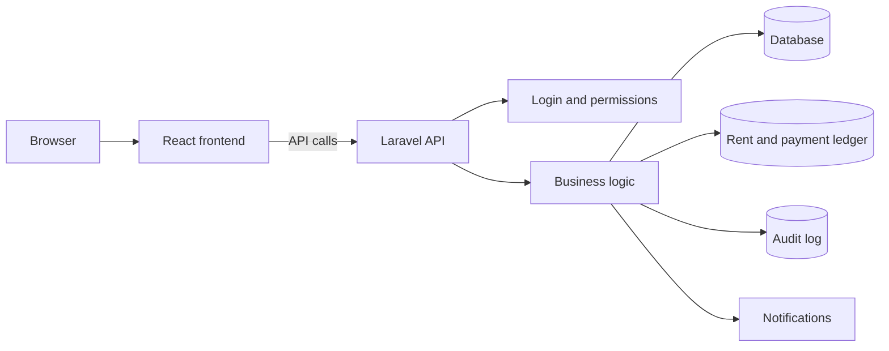
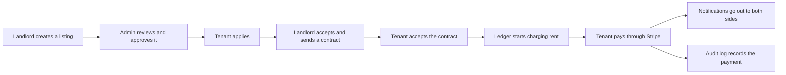

# Wyncrest

Wyncrest is a full-stack rental property management platform. It gives tenants, landlords, and admins one shared, trustworthy system for finding homes, managing leases, tracking rent, and keeping a permanent record of what happened.

| Area | Status |
|---|---|
| Backend | Laravel 12, stable, 692 automated tests passing |
| Frontend | React 18 + TypeScript, builds clean, lint clean |
| Database | SQLite for local development, MySQL and PostgreSQL supported |
| Authentication | Token-based login, separate tenant/landlord and admin accounts |
| Current state | Actively developed, running on a live demo deployment |

Maintainer: **Elton Sakyi**

---

## What Wyncrest does

Wyncrest manages a rental from the first listing to the last rent payment, in one place.

- **Tenants** find homes, apply, sign leases, pay rent, and message their landlord.
- **Landlords** list properties, review applicants, send contracts, and track rent collection.
- **Admins** moderate listings, verify identities, and keep the platform healthy.
- **Super admins** decide which admins can do what.

Every rent charge, payment, and privileged action is written to a permanent record that cannot be quietly edited later. That record is what makes the platform trustworthy: a landlord, a tenant, or an auditor can always see exactly what happened and when.

## Who uses Wyncrest

| Role | What they can do |
|---|---|
| **Tenant** | Browse listings, apply, manage their own lease, pay rent, message their landlord, request maintenance |
| **Landlord** | List properties, review applicants, send contracts, track their own ledger and tenants |
| **Admin** | Moderate listings and reviews, verify identities, manage user accounts, view the audit log |
| **Super admin** | Everything an admin can do, plus deciding which capabilities other admins are granted |

Full detail on what each role can and cannot do: [`docs/AUTHORIZATION.md`](docs/AUTHORIZATION.md).

## Features

| Group | What it covers |
|---|---|
| Accounts and access | Registration, login, roles, granular admin permissions |
| Properties and listings | Property and unit catalogues, public listings, admin moderation |
| Contracts | Lease drafting, sending, acceptance, and termination |
| Ledger and payments | Rent charges, late fees, Stripe-backed payments, balance tracking |
| Notifications | In-app, email, and SMS alerts for the events that matter |
| Audit logs | A permanent, hash-verified record of every privileged action |
| Admin controls | User moderation, feature gating, platform analytics |
| UI and themes | Light and dark mode, a selectable accent color, a shared design system |

## How it fits together

The frontend never decides what a user is allowed to do. It only asks the backend, and the backend enforces every rule. Full detail: [`docs/ARCHITECTURE.md`](docs/ARCHITECTURE.md).

## A typical rental, start to finish

## Tech stack

| Layer | Technology |
|---|---|
| Frontend | React 18, TypeScript, Vite, Tailwind CSS |
| Backend | Laravel 12, PHP 8.2+ |
| Database | SQLite locally, MySQL or PostgreSQL supported |
| Authentication | Laravel Sanctum (token-based) |
| Payments | Stripe |
| Messaging | Twilio (SMS) |
| Testing | PHPUnit (backend), ESLint and TypeScript checks (frontend) |

## Getting started

Wyncrest has a one-command local runner that resets the database, seeds realistic demo data, and starts everything at once. Full setup steps, prerequisites, and troubleshooting live in [`docs/DEVELOPMENT.md`](docs/DEVELOPMENT.md).

## Development mode vs. production mode

| | Development mode | Production mode |
|---|---|---|
| Purpose | A realistic local demo world for building and testing | A clean, real platform with no invented data |
| Demo accounts | Yes, several landlords and tenants | Never |
| Fake rent, contracts, or payments | Yes, for testing | Never |
| Safe to reset | Yes, any time | No, production data is never wiped |

Full detail, including how demo accounts are structured: [`docs/SEEDING.md`](docs/SEEDING.md).

## Security, in short

- Every protected action is checked on the backend, not just hidden in the interface.
- Admin access is granular: a super admin decides exactly what each admin can do.
- Rent and payment history cannot be edited after the fact, only corrected with a new, visible entry.
- Every privileged action is written to a permanent audit log.

Full security policy: [`SECURITY.md`](SECURITY.md). Full access-control model: [`docs/AUTHORIZATION.md`](docs/AUTHORIZATION.md).

## Documentation map

| Doc | What it covers |
|---|---|
| [`SECURITY.md`](SECURITY.md) | Security policy, how to report an issue, production safety rules |
| [`CONTRIBUTING.md`](CONTRIBUTING.md) | How to contribute, git rules, and commit standards |
| [`docs/README.md`](docs/README.md) | Index of every doc in the `docs/` folder |
| [`docs/ARCHITECTURE.md`](docs/ARCHITECTURE.md) | How the system is put together, and why |
| [`docs/AUTHORIZATION.md`](docs/AUTHORIZATION.md) | Roles, admin capabilities, and how access is enforced |
| [`docs/DATABASE.md`](docs/DATABASE.md) | The main data areas and how they relate |
| [`docs/DEVELOPMENT.md`](docs/DEVELOPMENT.md) | Local setup, running the app, common problems |
| [`docs/DEPLOYMENT.md`](docs/DEPLOYMENT.md) | Deployment checklist and the live demo box |
| [`docs/SEEDING.md`](docs/SEEDING.md) | Demo data, production seeding, and the two seeding modes |
| [`docs/TESTING.md`](docs/TESTING.md) | What is tested, and how to verify before pushing |
| [`docs/LEDGER.md`](docs/LEDGER.md) | How rent, payments, and balances work |
| [`docs/UI_SYSTEM.md`](docs/UI_SYSTEM.md) | The visual design system, themes, and accessibility rules |
| [`docs/API_REFERENCE.md`](docs/API_REFERENCE.md) | What each part of the API does, in plain language |
| [`docs/TROUBLESHOOTING.md`](docs/TROUBLESHOOTING.md) | Common problems and how to fix them |
| [`docs/GLOSSARY.md`](docs/GLOSSARY.md) | Plain-English definitions of every term used across these docs |
| [`docs/OPERATIONS.md`](docs/OPERATIONS.md) | Production safety checks and demo readiness |

## Known limitations

- No license has been chosen yet.
- The frontend has no automated test suite; UI changes are verified by lint, build, and manual browser review. See [`docs/TESTING.md`](docs/TESTING.md).
- A small set of internal identifiers (storage keys, cache key prefixes, one component name) still use the product's original working name, "Nexus," because renaming them would risk breaking existing local data. They are never shown to users. See [`docs/GLOSSARY.md`](docs/GLOSSARY.md) for the full list.

## License

License pending. No license has been chosen yet; all rights reserved until one is added.
