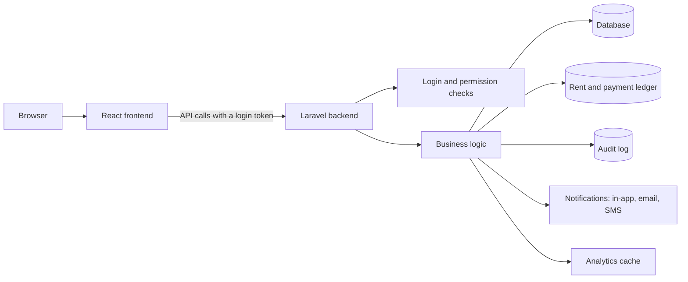
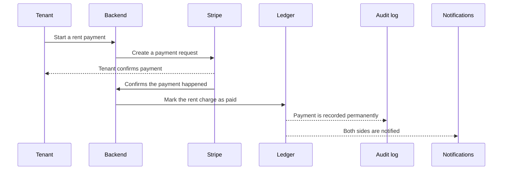

# Architecture

How Wyncrest is put together, and why it is built this way.

Who this is for: developers joining the project, and anyone reviewing the codebase who wants to understand the shape of the system before reading code.

## System overview

Wyncrest is two separate applications that talk to each other over the network: a React frontend that runs in the browser, and a Laravel backend that owns all the data and all the rules. The frontend never talks to the database directly, and it never decides what a user is allowed to do. It only asks the backend, and the backend decides.

## Frontend responsibilities

The frontend's job is to present information clearly and to make requests on the user's behalf. It is responsible for:

- Showing the right screens for the logged-in user's role
- Collecting and validating form input before sending it
- Displaying the results of a request, including errors
- Remembering visual preferences like light or dark mode

It is deliberately **not** responsible for deciding what is allowed. If the frontend hides a button, that is a convenience, not a security boundary. The backend always makes the real decision. Full detail on the design system: [`docs/UI_SYSTEM.md`](UI_SYSTEM.md).

## Backend responsibilities

The backend is the single source of truth. Every request flows through the same layered path:

1. **Route and role check.** Is the caller logged in, and does their role match this part of the API?
2. **Validation and ownership check.** Is the request data valid, and does the caller actually own or have a right to the record involved?
3. **Business logic.** The actual work happens here: creating a contract, generating a rent charge, approving a listing.
4. **Side effects.** Anything that should happen afterward, like sending a notification or writing an audit log entry, happens automatically as a reaction to what just occurred, not as a manual extra step someone has to remember.

This layering means a screen or a controller can never accidentally skip a security check. The check lives at the layer the request has to pass through no matter what.

## Database responsibilities

The database stores everything permanently: accounts, properties, listings, contracts, the ledger, notifications, and the audit log. Full detail on the main data areas and how they relate: [`docs/DATABASE.md`](DATABASE.md).

Two areas of the database follow stricter rules than the rest:

- The **ledger** (rent charges, payments, late fees) can only ever grow. Entries are never edited or deleted; corrections are new entries. See [`docs/LEDGER.md`](LEDGER.md).
- The **audit log** works the same way: entries are permanent, and each one is cryptographically linked to the one before it, so tampering would be visible.

## The service layer

Business rules live in one place: the service layer, not scattered across screens or database code. A "controller" (the part of the backend that receives a request) stays thin: it checks permissions, hands the work to a service, and returns the result. The service does the actual work: calculating a balance, moving a contract from draft to sent, deciding whether a listing can be approved.

Keeping business rules in one place means a rule only has to be written once, and it behaves the same way no matter which screen triggered it.

## Authentication and authorization

- Authentication answers "who is this?" Wyncrest uses token-based login: a user logs in once and gets a token, which is sent with every request afterward.
- Authorization answers "what are they allowed to do?" Tenants, landlords, and admins each have their own rules, and admin access is further broken into granular capabilities that a super admin controls.

Full detail: [`docs/AUTHORIZATION.md`](AUTHORIZATION.md).

## Request lifecycle example: a tenant pays rent

Notice that the payment is only ever marked paid after Stripe confirms it happened, and that confirmation is verified, not just trusted. This protects against someone faking a "payment succeeded" request.

## Notifications

Notifications are never sent directly from the middle of a business action. Instead, an action announces that something happened, and a separate piece of code listens for that announcement and sends the notification. This keeps the business logic focused on the business rule, and means notification delivery (in-app, email, or SMS) can change without touching the logic that decided a notification was needed.

## Audit logging

The same pattern applies to audit logging. A privileged action does not have to remember to write its own audit entry; a listener does that automatically whenever the right kind of action happens. This makes it structurally hard to add a new privileged action and forget to log it.

## Analytics and caching

Dashboards and analytics are backed by cached calculations so they load quickly, even as the amount of data grows. The cache is scoped (a landlord's cache never leaks another landlord's numbers) and is automatically cleared only for the specific slice of data that changed, not the whole cache at once.

## Why this design matters

- **A security rule only has to be correct once.** Because permission checks live in one layer that every request passes through, there is no screen that can accidentally forget to check.
- **The audit log and ledger cannot lie by omission.** Because writing to them happens automatically as a side effect, not as a manual step, there is no code path that does the real action but skips the record.
- **The frontend can be redesigned freely.** Because it holds no business rules, changing how something looks or flows never risks changing what is actually allowed.
- **New features are predictable to add.** A new feature follows the same route, check, service, side-effect shape as every existing one, so it is easy for a new contributor to find where something belongs.
