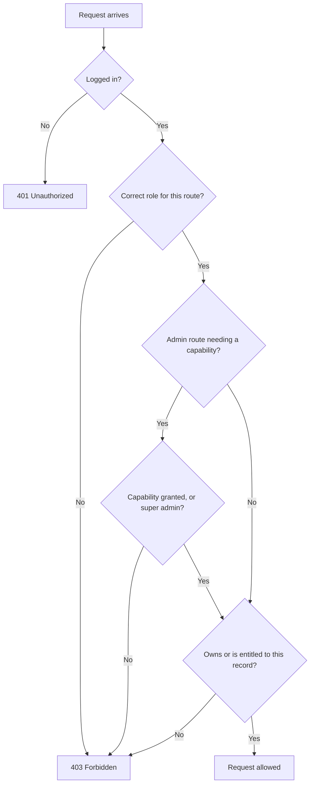

# Authorization

This document explains who can do what in Wyncrest, and how that is enforced.

Who this is for: developers implementing new features, reviewers checking the access model, and admins who need to understand what a role or capability actually grants.

## Roles

| Role | What they own | Typical actions |
|---|---|---|
| Tenant | Their own applications, lease, payments, messages | Apply for a listing, pay rent, message their landlord |
| Landlord | Their own properties, listings, contracts | List a property, review applicants, send a contract |
| Admin | Nothing by default, only what is granted | Depends entirely on granted capabilities |
| Super admin | Everything | Every admin action, plus managing other admins' access |

Tenant and landlord access is fixed by role: a tenant can never see another tenant's data, and a landlord can never see another landlord's property. Admin access works differently, and is explained below.

## Admin capabilities

Regular admins do not get full admin access automatically. Instead, a super admin grants specific capabilities. Each capability unlocks one area of the platform.

| Capability | What it unlocks |
|---|---|
| Manage access and admins | Open Manage Users & Permissions and manage the admin team |
| Manage users | Suspend, restore, block, or archive tenant and landlord accounts |
| Review verifications | Approve or reject identity verification requests |
| Moderate listings | Approve or reject listings waiting for review |
| Moderate reviews | Approve, reject, or remove tenant reviews of properties |
| Manage landlord features | Turn platform features on or off for a specific landlord |
| View audit log | Read and export the platform's audit log |
| Manage contracts | View all contracts platform-wide and force-terminate one if needed |
| Manage ledger | View the platform ledger and apply late fees |
| View analytics | View platform-wide analytics dashboards |
| Manage platform settings | Reserved for future global configuration; not yet connected to anything |

An admin with none of these capabilities can log in, but cannot open any of the areas above. Everything is denied by default.

## Super admin behavior

- A super admin has every capability automatically. Nothing needs to be granted.
- A super admin can grant or remove any capability from any other admin.
- A super admin can promote another admin to super admin, or demote a super admin back to a scoped admin.
- Wyncrest always keeps at least one super admin. The last remaining super admin cannot be demoted or deactivated, so the platform can never end up with zero super admins.

## Scoped admin behavior

- A scoped admin starts with zero capabilities until a super admin grants some.
- Each capability is independent. Having "review verifications" does not imply "moderate listings."
- A capability that has not been granted is enforced as denied on the server, not just hidden from the menu.

## Manage Users & Permissions

This is the page where admin access itself is controlled, so it has its own rule:

**Manage Users & Permissions is only available to super admins by default.** A super admin can choose to grant a specific scoped admin access to this page as well, using the "manage access" capability, but that never happens automatically. An admin cannot grant themselves access to it.

## Backend enforcement

Frontend hiding is not security. A menu item being hidden, or a button being disabled, is a convenience for the user, not a protection against a determined one.

Every protected action is checked on the server in layers:

1. **Is this person logged in at all?** If not, the request is rejected before anything else runs.
2. **Does their role allow this kind of action?** A tenant token cannot reach landlord or admin routes, and vice versa.
3. **For admins, do they hold the specific capability this action requires?** If not, the request is rejected even though they are a logged-in admin.
4. **Do they own, or otherwise have a legitimate claim to, this specific record?** A landlord cannot view another landlord's contract just because they are a landlord.

If any layer fails, the request is refused. The frontend never makes this decision; it only reflects what the backend has already decided.

## 401 vs 403, in plain terms

| Response | Plain meaning | Example |
|---|---|---|
| 401 Unauthorized | "I do not know who you are." No valid login was presented. | An expired or missing login token |
| 403 Forbidden | "I know who you are, and the answer is no." A valid login was presented, but this account is not allowed to do this. | A tenant trying to open an admin page, or a scoped admin without the right capability |

## Access decision flow

## Common examples

| Scenario | Result | Why |
|---|---|---|
| A tenant opens their own lease | Allowed | They own the record |
| A tenant opens another tenant's lease by guessing a link | 403 | They do not own the record |
| An admin with no capabilities opens the audit log | 403 | The "view audit log" capability was never granted |
| A scoped admin with "moderate listings" tries to suspend a user | 403 | That requires the separate "manage users" capability |
| A super admin opens Manage Users & Permissions | Allowed | Super admins always have access |
| A scoped admin opens Manage Users & Permissions without being granted access | 403 | This page requires super admin, or an explicit grant |
| Someone with an expired login token makes any request | 401 | They are not recognized as logged in at all |
