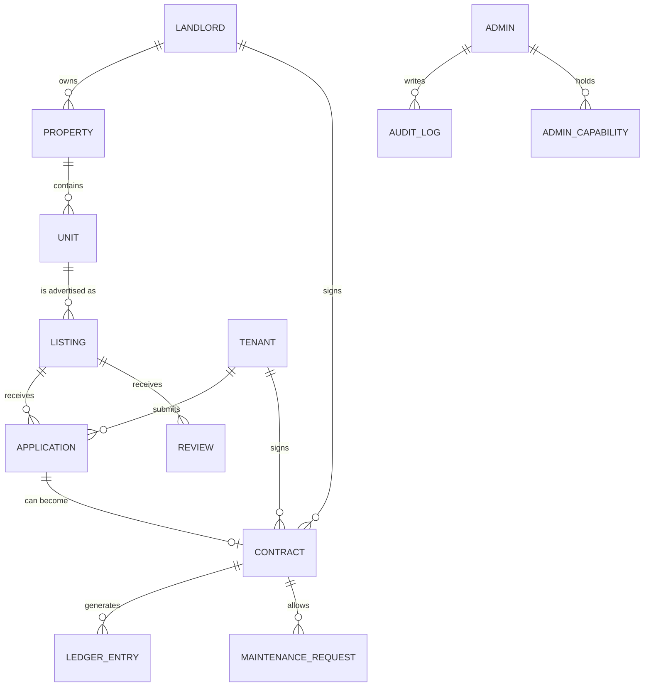

# Database

A plain-English map of what Wyncrest stores and how it connects.

Who this is for: developers who need to understand the data model before adding a feature, and reviewers who want to see how the pieces fit together.

## Main data areas

| Area | What it stores |
|---|---|
| Users and admins | Tenant and landlord accounts in one table, admin accounts in a completely separate table |
| Properties | A building or land parcel owned by a landlord |
| Units | An individual rentable space within a property |
| Listings | A unit being advertised for rent, with its own approval status |
| Applications | A tenant's request to rent a specific listing |
| Contracts | The lease agreement between a landlord and a tenant |
| Ledger entries | Every rent charge, payment, late fee, and refund, permanently |
| Notifications | In-app, email, and SMS alerts sent to a user |
| Audit logs | A permanent record of privileged actions |
| Admin capabilities | Which specific permissions each admin has been granted |
| Reviews | A tenant's review of a property after their lease |
| Verification requests | Identity documents submitted for admin approval |
| Media assets | Photos attached to properties, units, listings, and profiles |
| Maintenance requests | A tenant's report of a problem with their unit |
| Conversations and messages | Direct messaging between users |

## How they relate

## Important rules

| Rule | Why |
|---|---|
| Ledger entries are append-only | Once a rent charge or payment is recorded, it is never edited or deleted. A correction is a new entry, so the money history can always be trusted. |
| Audit logs are append-only and chained | Every privileged action is written once and never changed. Each entry links to the one before it, so tampering would be visible. |
| Contracts and ledger entries use non-sequential identifiers | This prevents someone from guessing another tenant's contract by simply incrementing a number in a URL. |
| Deleting a user, property, or listing does not erase it | These records are marked removed rather than physically deleted, so financial and legal history is never lost. |
| Production setup never creates demo data | The only thing production setup can add is a single optional admin account, and only if it was explicitly configured. See [`docs/SEEDING.md`](SEEDING.md). |

## Local development

Wyncrest uses SQLite by default for local development, stored as a single file on disk. This keeps setup simple: no separate database server to install or run. MySQL and PostgreSQL are both supported for larger deployments; the database type is controlled by an environment setting, not by application code.
