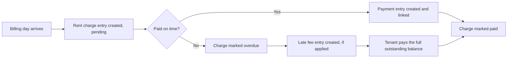

# The Ledger

How Wyncrest tracks rent, payments, and balances, explained simply enough for a non-technical admin to follow.

Who this is for: anyone who wants to understand how money is tracked in Wyncrest, technical or not.

## What the ledger is

The ledger is a permanent, growing list of money events for every lease: every rent charge, every payment, every late fee, every refund. Think of it like a bank statement that can never be edited, only added to.

A tenant's current balance is never stored as a single number that could be quietly changed. It is always calculated by adding up every entry in their ledger. If you want to know whether a tenant owes money, you read the history, not a separate "balance" field that someone could tamper with.

## Why it matters

This design means nobody, not a bug, not a mistake, not a bad actor, can make a tenant's balance disappear or appear out of nowhere. Every dollar (or cedi) is traceable to a specific, timestamped entry. That is what makes the financial history trustworthy enough for a landlord, a tenant, or a dispute to rely on.

## Rent charges

On the tenant's billing day each month, a new rent charge entry is created automatically. It starts as pending.

## Payments

When a tenant pays, a payment entry is created and linked to the charge it settles. Wyncrest only marks a charge as paid after the payment processor (Stripe) confirms the payment actually happened. It never trusts a "payment succeeded" message from the browser alone.

## Late fees

If a rent charge is not paid by its due date, it moves to overdue. A late fee can then be applied, which creates its own separate entry rather than changing the original charge.

## Overdue balances

A tenant's outstanding balance is the sum of every unpaid or overdue entry on their ledger. Because this is calculated fresh from the real entries every time, it can never drift out of sync with reality.

## Why balances are derived, not stored

If a balance were stored as its own number, two things could go wrong: it could fall out of sync with the actual entries, or someone could edit it directly without leaving a trace. By always calculating the balance from the entries themselves, both problems disappear. The entries are the only truth.

## Why entries are never edited directly

A ledger entry, once written, stays exactly as it was written. If a charge was wrong, or a payment needs reversing, Wyncrest adds a new, visible correcting entry rather than silently changing the old one. This means the ledger always shows the full, honest history, including mistakes and their corrections, instead of a cleaned-up version that hides what actually happened.

## How this protects trust

- A tenant can always see exactly why they owe what they owe.
- A landlord can always see exactly what was charged and what was paid.
- An admin investigating a dispute can see the real order of events, not a summary that could have been edited after the fact.
- Nobody, including an admin, can make a balance vanish without leaving a visible entry behind.

## A rent cycle, start to finish

